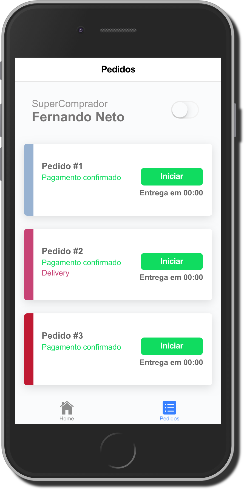

# AppSuper

App que lista pedidos a serem separados.

## Telas do App

Página Inicial             |  Página de Pedidos
:-------------------------:|:-------------------------:
  | 

## Organização dos Diretórios

### Diretório `app/components`

Aqui ficará todos os componentes do aplicativo. Todos os componentes terão seu próprio diretório, e serão registrados no arquivo de módulo `components.module` que é importado no módulo principal.

### Diretório `app/scss`

Aqui ficará todos os estilos customizados para o aplicativo. Caso você queira importar algum tema ou css de algum library, também pode ser colocado aqui.

### Diretório `app/services`

Aqui ficará todos os services da aplicação separados por módulo ou componentes. Todos são registrados no arquivo `services.module` que é importado no módulo principal.

## Executando a Aplicação

### Clonando o projeto

```bash
$ git clone https://github.com/dejaneves/test-frontend.git
```

### Instalando as Dependêcias

Após baixar o projeto entre na pasta `test-frontend`.

```bash
$ cd test-frontend
```
e execute o sequinte comando, para instalar as dependências.

```bash
$ npm install
```
rodando o projeto

```bash
$ ionic serve
ng run app:serve --host=0.0.0.0 --port=8100
```

para ver a aplicação rodando no browser: http://localhost:8100